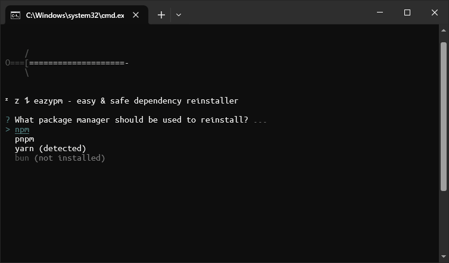

# ⚡ eazypm


Easy and safe dependency reinstaller for npm, pnpm, yarn, and bun modules with Aikido's [safe-chain](https://github.com/AikidoSec/safe-chain).



## Description

eazypm is a command-line tool designed to safely reinstall dependencies for Node.js projects using various package managers (npm, pnpm, yarn, bun). It leverages Aikido's safe-chain to ensure secure and reliable installations, preventing common issues like dependency conflicts or malicious packages.

## Features

- **Automatic Package Manager Detection**: Detects the package manager based on lock files (pnpm-lock.yaml, yarn.lock, package-lock.json, bun.lockb).
- **Safe Reinstallation**: Uses Aikido's safe-chain for secure dependency installation.
- **Backup Creation**: Automatically backs up your project files before reinstallation.
- **Interactive CLI**: User-friendly prompts to select package manager and confirm actions.
- **Cross-Platform**: Works on Windows, macOS, and Linux.
- **Support for Multiple Package Managers**: Compatible with npm, pnpm, yarn, and bun.

## Installation

Install eazypm globally using npm:

```bash
npm install -g eazypm
```

Or install it locally in your project:

```bash
npm install --save-dev eazypm
```

## Usage

Navigate to your Node.js project directory and run:

```bash
eazypm
```

The tool will:

- Detect the package manager used in your project.
- Prompt you to select a package manager (with the detected one pre-selected).
- Read your dependencies from `package.json` and lock files.
- Ensure Aikido is installed locally.
- Generate a safe-chain install command and save it to `install-command.txt`.
- Ask if you want to backup and run the installation automatically.

If you choose to run automatically, it will:

- Create a backup of your project files.
- Remove existing packages.
- Reinstall dependencies using the native package manager.
- Run the Aikido safe-chain command.

## Requirements

- Node.js >= 18
- Supported package managers: npm, pnpm, yarn, or bun


## Contributing

Contributions are welcome! Please feel free to submit a Pull Request.

## License

This project is licensed under the MIT License - see the [LICENSE](LICENSE) file for details.
